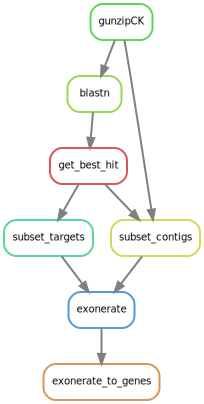

Snakemake pipeline used to recover Angiosperms 353 genes from public, unannotated, assemblies.

## Assemblies preparation

Make a text file of assemblies accession IDs, one by line, and name it AssembliesID_ls.txt

Use the following code to download and process the sequences into a fasta file

```shell
ncpu=4
while read accession; do
	echo $accession
	
	./datasets download assembly $accession --filename $accession.zip
	unzip $accession.zip -d $accession
	cat $accession/ncbi_dataset/data/*/*.fna > in_fasta/$accession.fasta

	seqkit stats -j $ncpu in_fasta/$accession.fasta
	rm -r $accession
	rm $accession.zip
	makeblastdb -in in_fasta/$accession.fasta -dbtype nucl -parse_seqids
done < AssembliesID_ls.txt
```

## Snakemake pipeline



Run the pipeline with the following command, which will use the same list of samples as above. 

```shell
sbatch assemblies_snk.sh
```

Note it can be run outside a batch script directly with

```shell
snakemake --keep-going --cluster "sbatch -p medium --mem 60000 -N 1 --cpus-per-task 16 -J Assemblies" --jobs 10
```

